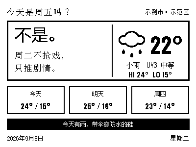
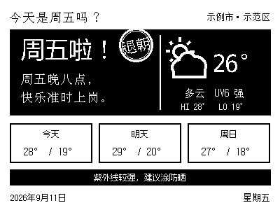

# 墨水屏「今天是周五吗？」+ 天气屏 · Zectrix Friday Weather

给 **Zectrix 400×300 单色墨水屏**渲染一页趣味屏：左栏是「今天是周五吗？」的每日文案，右栏是你所在城市的当天天气，下方是三天预报和一条出行穿搭建议。

思路来自开源项目 [eyaeya/today-is-friday](https://github.com/eyaeya/today-is-friday)（MIT），本项目为黑白单色屏重新排版，并叠加了本地天气、紫外线与穿搭建议。



周五傍晚（16:00 后）会切换成黑底反白，并在右上角盖上「退朝」印章：


*周五 18:30 · 黑底反白 + 退朝印章 + 多云图标 + 紫外线提示*

## 屏上都有什么

```
┌──────────────────────────────────────────────┐
│ 今天是周五吗？                      成都·成华区 │
├────────────────────────┬─────────────────────┤
│  休息。                 │   ☀      33°        │
│                        │      晴  UV8 很强    │
│  今天只负责             │     HI 34°  LO 24°  │
│  吃好玩好。             │                     │
├──────────┬──────────┬──────────┬─────────────┤
│  今天     │  明天     │  周一     │            │
│ 34° / 24°│ 35° / 25°│ 34° / 25°│            │
├──────────┴──────────┴──────────┴─────────────┤
│       明天有雨仍闷热，带伞穿透气短袖             │
├──────────────────────────────────────────────┤
│ 2026年9月5日                          星期六   │
└──────────────────────────────────────────────┘
```

- **左栏**：开场语 + 两行趣味文案，按星期和时段切换文案池，洗牌袋选句，一轮内不重复
- **右栏**：大天气图标 + 大温度 + 天气状况 + **紫外线等级** + HI/LO
- **下方**：今/明/后三天预报格 + 一条按真实天气生成的建议（雨天带伞、高温防晒、低温添衣、温差提醒、紫外线涂防晒霜）

### 时段与配色规则

| 时间 | 开场语 | 配色 |
|------|--------|------|
| 周一 – 周四 | 不是。 | 白底黑字 |
| 周五 16:00 前 | 周五啦！ | 黑底反白 |
| 周五 16:00 后 | 周五啦！ + 右上「退朝」印章 | 黑底反白 |
| 周六、周日 19:00 前 | 休息。 | 黑底反白 |
| 周日 19:00 后 | 明天周一。 | 白底黑字 |

> 文案池 9 个（周一~周四 / 周五白天 / 周五晚 / 周六 / 周日白天 / 周日晚），每池 65 条，存在 `scripts/friday_phrases.json`，想加句子直接往里添即可。

## 快速开始

### 1. 安装依赖

```bash
pip install pillow
```

### 2. 初始化（首次必做）

项目**不含任何 API Key、设备号或坐标**，全部由你自己提供。

```bash
cd scripts
python3 init.py                 # 交互式引导，推荐
```

向导会依次要你填三样东西：

1. **Zectrix API Key** — 极趣云控制台获取，`zt_` 开头，输入不回显
2. **设备 ID** — 设备 MAC，形如 `AA:BB:CC:DD:EE:FF`
3. **所在地区** — 中文地名，如「成都成华区」「上海徐汇」。脚本会调 Open-Meteo 地理编码服务解析经纬度；Open-Meteo 只收录到市/县一级，区级地名会自动逐级回退（成都成华区 → 成都）

非交互式也可以：

```bash
python3 init.py --api-key zt_xxx --device AA:BB:CC:DD:EE:FF --place "成都成华区" --label "成都·成华区"
```

不确定设备号？先列一下：

```bash
python3 init.py --api-key zt_xxx --list-devices
```

初始化会校验 Key 是否有效、设备是否属于该 Key，然后写入 `~/.config/zectrix-friday-weather/config.json`：

```json
{
  "api_key": "zt_xxxxxxxxxxxxxxxx",
  "device_id": "AA:BB:CC:DD:EE:FF",
  "page": "5",
  "location": {
    "label": "成都·成华区",
    "lat": 30.6667,
    "lon": 104.0667,
    "timezone": "Asia/Shanghai"
  }
}
```

配置与选句状态都在 `~/.config/zectrix-friday-weather/`，不在项目目录内，所以仓库可以放心分享，不会泄露密钥。

### 3. 渲染并推送

```bash
cd scripts
ZECTRIX_NO_PUSH=1 python3 zectrix_friday_push.py   # 只渲染预览，出图 /tmp/zectrix_friday_screen.png
python3 zectrix_friday_push.py                     # 渲染并推送到墨水屏
```

未初始化时脚本会打印 `NEED_INIT:` 并以退出码 2 退出，按提示跑 `init.py` 即可。

## 定时推送

设备是**拉取式**刷新，接口返回 `code:0` 即成功，屏幕会在下次轮询时更新（不是推送完立刻变）。

文案按时段变化，建议每天 10:00 推一次。若想让周五 16:00 后出现「退朝」章、周日 19:00 后显示「明天周一。」，再补一条 19:00 的推送。

## 目录结构

| 文件 | 说明 |
|------|------|
| `scripts/init.py` | 初始化向导：收集 Key/设备/地区、地理编码、校验并写配置 |
| `scripts/zectrix_friday_push.py` | 渲染 + 推送主脚本 |
| `scripts/dev_render_sample.py` | 生成文档示例图（可指定星期/时段/天气，不推送不依赖真实天气） |
| `scripts/friday_phrases.json` | 9 × 65 条文案池，可直接编辑扩充 |
| `SKILL.md` | Agent Skills 格式说明，作为技能安装时读取 |
| `assets/preview.png` | 效果预览图 |

## 作为 Agent Skill 安装

把整个目录放到你的 skills 目录（如 `~/.workbuddy/skills/zectrix-friday-weather/`）即可被 Agent 识别，触发词见 `SKILL.md`。技能同样不含密钥，Agent 首次使用时会引导用户提供配置。

## 改样式时请注意（踩过的坑）

- **原生 400×300、1:1 渲染**，不要再放大后缩小；二值化阈值 `THRESHOLD=128`，推送时 `dither=false`（硬阈值，文字最锐利）
- **字体**自动探测顺序：`$ZECTRIX_FONT` → `~/Library/Fonts/Zfull.ttf`（点阵，小字号像素级锐利，最推荐）→ PingFang → 黑体 → Noto CJK
- **图标**用两遍绘制（先描边色外扩、再填背景色）得到无内线的粗轮廓，云体还能自然遮挡背后的太阳
- ▲▼ 等符号在点阵字体小字号会缺字形，一律用代码画
- **文字不加粗不描边**，1-bit 屏上加粗会糊成一团
- 右栏「图标 + 温度」先量文字实际宽度再居中；晴天图标光芒外扩，占位宽度要单独加宽
- multipart 上传时 `Content-Disposition` 与 `Content-Type` 之间**只能有一个 CRLF**，多写一个会导致服务端「图片转换失败」

## 数据来源与致谢

- 天气与紫外线：[Open-Meteo](https://open-meteo.com)（免费、无需注册 Key）
- 文案与时段规则思路：[eyaeya/today-is-friday](https://github.com/eyaeya/today-is-friday)（MIT）
- 设备与推送接口：[Zectrix 极趣云](https://cloud.zectrix.com)

## 许可

MIT License。文案内容仅供个人设备展示使用。
